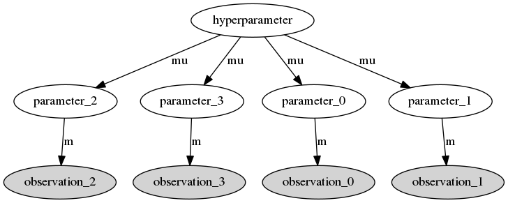
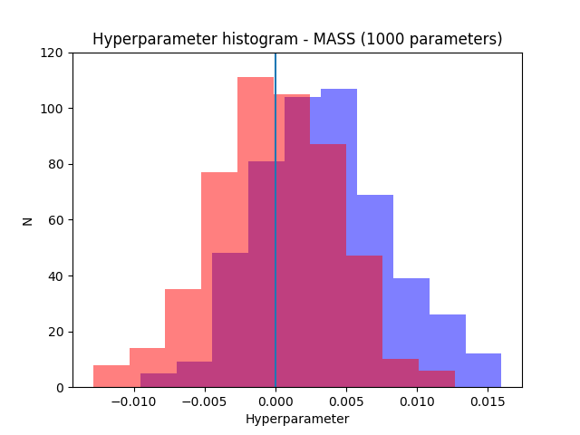
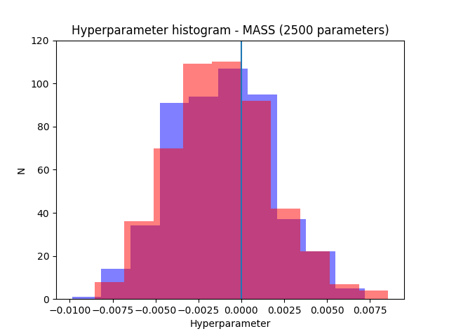

### Motivation

Bayesian hiearchical model in Astrophysical applications had a surge in popularity in recent years. These models have an hierarchical structure where the observed data comes from (many) probability distributions with their own parameters and where the different parameters are themselves random variables with a common ditribution which depends on given hyperparameters. The structure of a simple hierarchical model can be visualised as a Directed Acyclic Graph (DAG) as shown here.



The objective is to perform Bayesian inference simultaneously on the parameters and the hyperparameters. Usually this is done via MCMC sampling techniques. However, the size of some problems encountered in Astropysics applications, where the dimensions can be in the order of thousands or more, make these techniques computationally very expensive. So, there is the need to parallelize the computation as much as possible but most MCMC packages available in `Python`, like `pymc` are not prepared to parallelize the models. For this reason I decided to write a MCMC `Python` package capable of dealing with hierarchical models with dimensions of thousands or more, hence the name  Massive Sampler for MCMC Hierarchical Bayesian inference, shortened to `mass`. I respected the following requirements:

1. Can compute hiearchical models in parallel. In particular, it can distribute the computation of the likelihoods and priors across a number of nodes (local or not, i.e. can be used over a computer cluster)
2. Can tune the proposal distribution automatically (like `pymc`)
3. Can perform parallel tempering updates as seen [here](https://darrenjw.wordpress.com/2013/09/29/parallel-tempering-and-metropolis-coupled-mcmc/)


The hiearchical model can be written like this:
$$
P(\mathbf{X}, \mathbf{H}|\mathbf{Y}) = P(\mathbf{Y}|\mathbf{X})P(\mathbf{X}|\mathbf{H})P(\mathbf{H}), 
$$
where
$$
P(\mathbf{Y}|\mathbf{X}) = \prod_i P(Y_i|X_i)
$$
and 
$$
P(\mathbf{X}|\mathbf{H}) = \prod_i P(X_i|\mathbf{H}).
$$

so it is easy to see that both the likelihhods and the priors are trivial to parallelize with only one caveat: it is necessary to synchronize the hyperparameter updates. The MCMC scheme is to perform Metroplis updates in a variable then cycling through all the variables (sometimes this process is called Metropolis within Gibbs). This means that before performing an update in the hyperparameter it is necessary to collect the the current state of all variables $$X_i$$, and to perform an update in any $$X_i$$ it is necessary to collect the current state of the hyperparameter $$\mathbf{H}$$. It is easy to see that all this can be done with a single synchronization point in each cycle: update the hyperparameter first then update all the $$X_i$$ at the same time.

### Test

To test the package I used a very simple model (with improper hyperprior):

$$
Y_i \sim N(X_i, 0.1)

$$

$$
X_i \sim N(H, 0.1)

$$

$$
H \sim Un(-\infty, \infty)
$$

The `mass`package expects the (unnormalized) log of these three distributions (the common likelihoods, the common priors and an hyperprior). In `Python` they can be written like this:

```python
import numpy as np

def like(x, data):
    f = -(data-x)**2.
    e = 2.*0.1**2.
    return np.sum(f/e)

def prior(x, h):
    f = -(x - h)**2.
    e = 2.*0.1**2.
    return np.sum(f/e)

def hyperprior(h):
    return np.log(1.)
```

If I store these functions in a module called `test`, the sampling is done like this:

```python
import numpy as np
import mass
import test

nc = 3 #Number of dimensions of X
nb = 1000 #Number of parameters X
nw = 1 #Number of walkers for parallel tempering
n = nb * nw
p0 = np.ones(n*nc)*5 #Initial guesses for the parameters
data = []

#Create random data
for i in range(nb):
    rd = np.random.normal(0,0.1,nc)
    for j in range(nw):
        data.append(rd)

data = np.array(data)
p0 = p0.reshape((n,nc))
data = data.reshape((n,nc))
h0 = np.ones(1) * 10.

f1 = test.like
f2 = test.prior
f3 = test.hyperprior

model2 = mass.Model(p0, h0, f1,f2,f3, data, "cluster.cfg",  depends=["normaltest"])
mcmc2 = mass.Mcmc(model2)
mcmc2.sample(5000, p0, h0, thin=10, burnin=500, sampling_method="cycle", temperatures=[1.], tempering=False, adaptcov=False, tune_throughout=True, tune_interval=50, adaptation_delay=0, adaptation_interval=50)

```

This iterates 5000 times, after a burnin period of 500 and thinning the sample by a factor of 10. I did tree tests: with 100 1000 and 2500 parameters (dimensions). I repeated the same using the package`pymc 2` to check the results and access the perfomance gain obtained using parallelization.

The following plots show the results for 1000 and 2500 parameters. The resultsfor `mass` in blue and the results for `pymc` in red.





As can be seen both packages manage to recover the correct result (the parameters were generated from normal distribution with zero mean). Note also how the uncertainty decreases when the number of parameters increases as expected.

To compare the performance of `mass` with `pymc` I timed the three tests obtaining these results:

|         | 100 pars           | 1000 pars  | 2500 pars   |
| :------------- |-------------:| -----:| -----:|
| `mass`     | 41 sec | 220 sec |  540 sec   |
| `pymc`      | 20 sec      |   246 sec| 580 sec   |

We can see that while with 100 parameters `pymc` only takes half of the time needed by `mass`, as we increase the number of parameters to 1000 and 2500 `mass` becomes about 10% faster. However, these tests were performed in quad-core machine and it can be seen that more cores would be needed to improve the performance with 1000 parameters (the increase in time between 1000 and 2500 is linear, so there was already no gain from parallelization). So, the important part is that there is a gain in peformance by parallelizing the computation as expected (even for this very simple model, the gain should be larger for more complicated models).